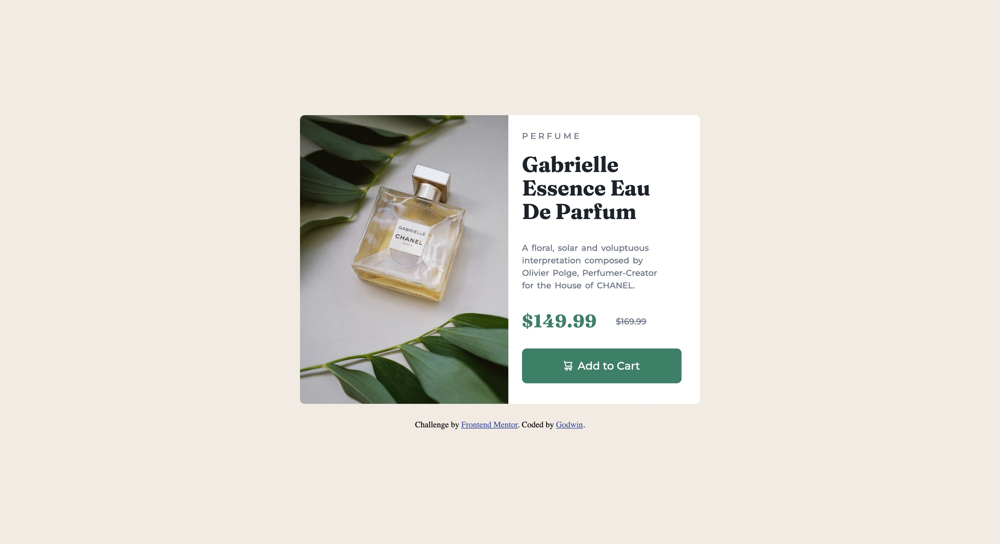

# Frontend Mentor - Product preview card component solution

This is a solution to the [Product preview card component challenge on Frontend Mentor](https://www.frontendmentor.io/challenges/product-preview-card-component-GO7UmttRfa). Frontend Mentor challenges help you improve your coding skills by building realistic projects. 

## Table of contents

- [Overview](#overview)
  - [The challenge](#the-challenge)
  - [Screenshot](#screenshot)
  - [Links](#links)
- [My process](#my-process)
  - [Built with](#built-with)
  - [What I learned](#what-i-learned)
  - [Continued development](#continued-development)
- [Author](#author)

## Overview

### The challenge

Users should be able to:

- View the optimal layout depending on their device's screen size
- See hover and focus states for interactive elements

### Screenshot
- Desktop screenshot

- Mobile screenshot

### Links

- Solution URL: [Add solution URL here](https://your-solution-url.com)
- Github URL: [Git URL @itadori-kun](https://github.com/itadori-kun/Product-preview-card.git)

## My process

### Built with

- Semantic HTML5 markup
- CSS custom properties
- Flexbox
- Vs code extension

### Continued development

responsiveness of webpages

## Author

- Frontend Mentor - [@itadori-kun](https://www.frontendmentor.io/profile/itadori-kun)
- Twitter - [@Godwincruise](https://www.twitter.com/Godwincruise)

